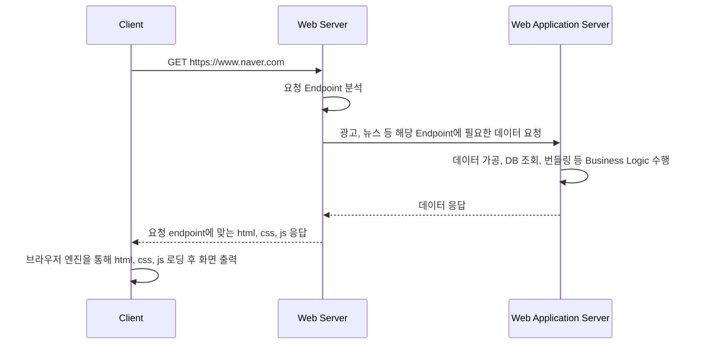

```mermaid
sequenceDiagram

participant c as Client
participant w as Web Server
participant s as Web Application Server

c->>w: GET https://www.naver.com
w->>w: 요청 Endpoint 분석
w->>s: 광고, 뉴스 등 해당 Endpoint에 필요한 데이터 요청
s->>s: 데이터 가공, DB 조회, 번들링 등 Business Logic 수행
s-->>w: 데이터 응답
w-->>c: 요청 endpoint에 맞는 html, css, js 응답
c->>c: 브라우저 엔진을 통해 html, css, js 로딩 후 화면 출력
```
